# DigitalCrownSample

Just A Simple WatchKit App Learning WWDC 2015 Session 207 & 208.

## ScreenShots
### Main Screen
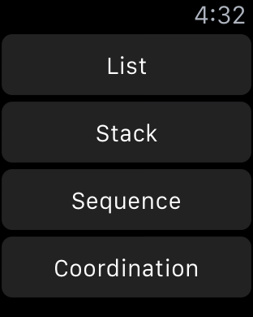

### List Picker
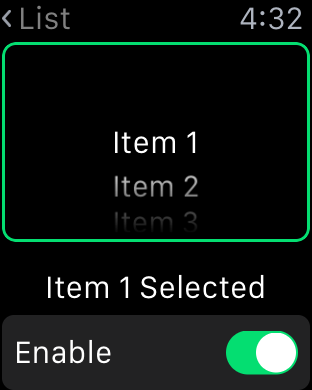
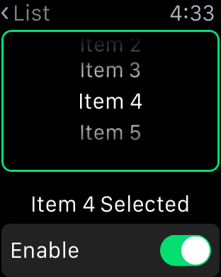
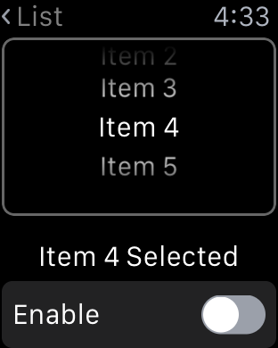

### Stack Picker
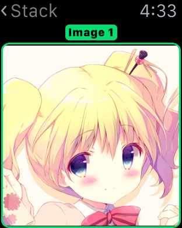
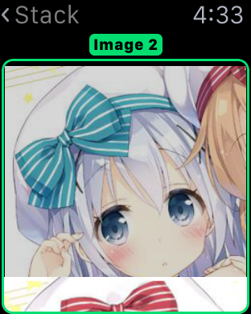

### Sequence Picker
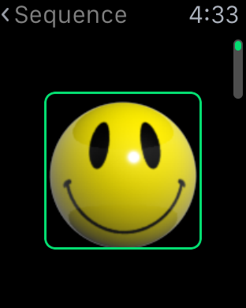
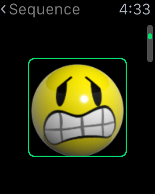
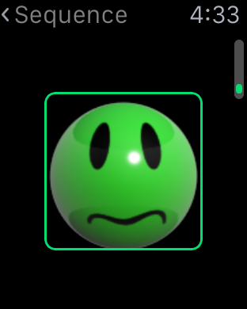

### Coordination
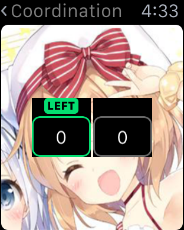
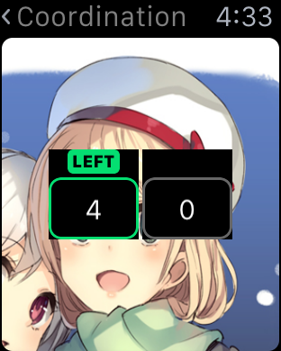
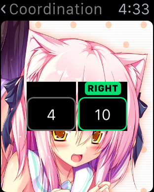